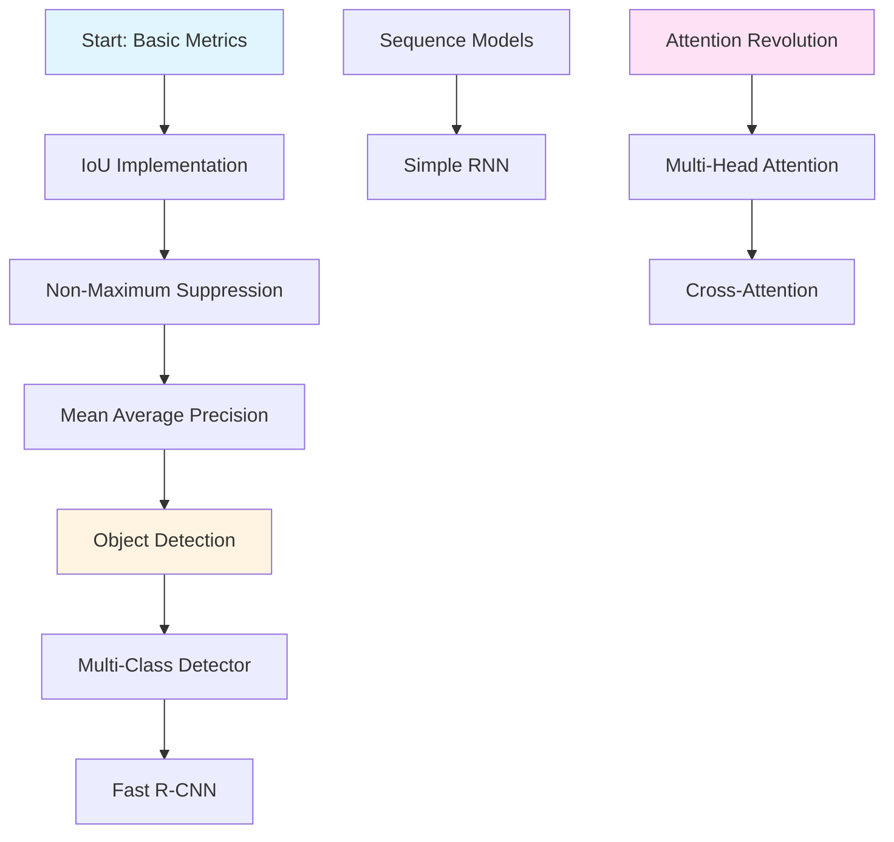

<div align="center">

# 🧠 AI Concepts From Scratch

### *Demystifying Artificial Intelligence, One Algorithm at a Time*

[](https://python.org)
[](https://pytorch.org)
[](LICENSE)

*Dive deep into the mathematical elegance and computational beauty of AI algorithms by building them from the ground up.*

[Explore Implementations](#-implemented-concepts) • [Why From Scratch?](#-why-from-scratch) • [Get Started](#-getting-started)

---

</div>

## 🌟 About This Repository

Welcome to a journey through the foundations of artificial intelligence! This repository is a curated collection of AI and deep learning algorithms implemented from first principles. Each implementation peels back the layers of abstraction to reveal the elegant mathematics and clever engineering that power modern AI systems.

> **Philosophy:** *"What I cannot create, I do not understand."* – Richard Feynman

By rebuilding these algorithms without relying on high-level abstractions, we gain intuition that no amount of reading can provide. This is learning by doing, understanding by building.

## 💡 Why From Scratch?

<table>
<tr>
<td width="50%">

### 🔬 **Deep Understanding**
Move beyond surface-level knowledge. When you implement backpropagation by hand or derive attention mechanisms from scratch, the mathematics becomes intuition.

### 🐛 **Master Debugging**
Know exactly what's happening at every step. Identify bottlenecks, understand edge cases, and optimize with confidence.

</td>
<td width="50%">

### 🎯 **Interview Excellence**
Stand out in technical interviews. Demonstrate not just what algorithms do, but *how* and *why* they work.

### 🚀 **Innovation Ready**
Understanding fundamentals is the foundation for innovation. You can't improve what you don't understand.

</td>
</tr>
</table>

---

## 🔥 Implemented Concepts

### 🎯 Computer Vision & Object Detection

<details open>
<summary><b>Click to explore vision algorithms</b></summary>

<br>

#### 📐 **Intersection over Union (IoU)**
> *The fundamental metric for measuring bounding box overlap*

IoU quantifies how well two bounding boxes align—essential for evaluating object detection models and implementing NMS.

**[🔍 View Implementation](https://github.com/mohamed-ehab415/IOU_from_scarth/blob/main/IOU%20from%20scratsh.py)**

---

#### 🎭 **Non-Maximum Suppression (NMS)**
> *Eliminating redundant detections with elegance*

When a detector fires multiple times for the same object, NMS intelligently selects the best prediction and suppresses the rest.

**[🔍 View Implementation](https://github.com/mohamed-ehab415/IOU_from_scarth/blob/main/Non%20Max%20Suppression.py)**

---

#### 📊 **Mean Average Precision (mAP)**
> *The gold standard for detection evaluation*

mAP combines precision and recall across all classes and IoU thresholds, providing a single metric that captures model performance comprehensively.

**[🔍 View Implementation](https://github.com/mohamed-ehab415/AI-Concepts-From-Scratch/blob/main/Mean%20Average%20Precision.py)**

---

#### 🎨 **Multi-Class Object Detector**
> *End-to-end detection with ResNet50 backbone*

A complete detection pipeline combining classification and localization. Features dual-head architecture with CrossEntropyLoss for classes and MSELoss for bounding boxes.

**Key Features:**
- 🏗️ ResNet50 feature extraction
- 🎯 Multi-class classification head
- 📦 Bounding box regression head
- ⚡ Efficient single-stage detection

**[🔍 View Implementation](https://github.com/mohamed-ehab415/AI-Concepts-From-Scratch/blob/main/mycode_simple_detector.py)**

---

#### 🚄 **Fast R-CNN**
> *Region-based detection with RoI pooling magic*

The evolution of object detection: propose regions, pool features, and predict classes and boxes in one efficient forward pass.

**Architecture Highlights:**
- 🎯 Region of Interest (RoI) pooling
- 🏗️ ResNet50 backbone (1024 channels)
- 🔀 Dual prediction heads (classification + regression)
- ⚡ Efficient multi-object detection

**[🔍 View Implementation](https://github.com/mohamed-ehab415/AI-Concepts-From-Scratch/blob/main/Fast__RCNN.py)**

</details>

---

### 🤖 Attention Mechanisms & Transformers

<details open>
<summary><b>Click to explore attention mechanisms</b></summary>

<br>

#### ✨ **Multi-Head Attention**
> *The revolutionary mechanism that changed NLP forever*

Multi-head attention allows models to attend to different representation subspaces simultaneously—the core innovation behind Transformers that dethroned RNNs.

**What makes it special:**
- 👁️ Multiple attention heads working in parallel
- 🔄 Learns different relationships simultaneously
- 🎯 Captures both local and global dependencies

**[🔍 View Implementation](https://github.com/mohamed-ehab415/AI-Concepts-From-Scratch/blob/main/multi-head-att.py)**

---

#### 🔗 **Cross-Attention**
> *When two sequences need to talk to each other*

Cross-attention enables one sequence to attend to another—fundamental for translation, image captioning, and any encoder-decoder architecture.

**Use cases:**
- 🌍 Machine translation (target attends to source)
- 🖼️ Image captioning (text attends to image features)
- 🎵 Speech-to-text (transcript attends to audio)

**[🔍 View Implementation](https://github.com/mohamed-ehab415/AI-Concepts-From-Scratch/blob/main/cross_attention.py)**

</details>

---

### 🔄 Recurrent Neural Networks

<details open>
<summary><b>Click to explore sequential models</b></summary>

<br>

#### 📝 **Simple RNN**
> *The foundation of sequential learning*

Before Transformers dominated, RNNs were the go-to architecture for sequential data. Understanding RNNs illuminates why attention mechanisms were such a breakthrough.

**Core concepts:**
- 🔄 Hidden state propagation through time
- 📈 Sequential data processing
- 🧠 Memory across time steps

**[🔍 View Implementation](https://github.com/mohamed-ehab415/AI-Concepts-From-Scratch/blob/main/Simple_RNN_Pyton.py)**

</details>

---

## 🗺️ Learning Roadmap



**Suggested Learning Path:**
1. 🎯 Start with **IoU** and **NMS** to understand detection fundamentals
2. 📊 Progress to **mAP** for evaluation metrics
3. 🎨 Build your first detector with **Multi-Class Object Detector**
4. 🚄 Level up to region-based detection with **Fast R-CNN**
5. 🔄 Explore sequential processing with **Simple RNN**
6. ✨ Dive into modern architectures with **Multi-Head Attention**
7. 🔗 Master encoder-decoder patterns with **Cross-Attention**

---

## 🛠️ Tech Stack

<div align="center">


</div>

---

## 🚀 Getting Started

```bash
# Clone this repository
git clone https://github.com/mohamed-ehab415/AI-Concepts-From-Scratch.git

# Navigate to the directory
cd AI-Concepts-From-Scratch

# Each implementation is self-contained and documented
# Pick any concept and start learning!
```

---

## 🌟 What Makes This Different?

| Feature | This Repo | Typical Tutorials |
|---------|-----------|-------------------|
| **Depth** | Mathematical foundations | Surface-level API calls |
| **Clarity** | Detailed inline comments | Minimal explanation |
| **Practicality** | Production-ready patterns | Toy examples |
| **Progression** | Structured learning path | Random collection |

---

## 🤝 Contributing

Contributions are not just welcome—they're encouraged! Whether it's:

- 🐛 Bug fixes
- 📝 Documentation improvements
- ✨ New algorithm implementations
- 💡 Optimization suggestions

**Steps to contribute:**
1. Fork the repository
2. Create your feature branch (`git checkout -b feature/AmazingFeature`)
3. Commit your changes (`git commit -m 'Add some AmazingFeature'`)
4. Push to the branch (`git push origin feature/AmazingFeature`)
5. Open a Pull Request

---

## 📚 Resources & References

**Books:**
- 📖 *Deep Learning* by Goodfellow, Bengio, and Courville
- 📖 *Pattern Recognition and Machine Learning* by Christopher Bishop

**Papers:**
- 📄 Fast R-CNN (Girshick, 2015)
- 📄 Attention Is All You Need (Vaswani et al., 2017)

---

## 📬 Connect & Discuss

Have questions? Want to discuss implementations? Found a bug?

- 💬 Open an [Issue](https://github.com/mohamed-ehab415/AI-Concepts-From-Scratch/issues)
- ⭐ Star this repo if you find it helpful
- 🔄 Share with others who want to understand AI deeply

---

<div align="center">

### 💫 *"Understanding is the foundation of innovation"*

**Built with 🧠 by passionate AI learners**

[⬆ Back to Top](#-ai-concepts-from-scratch)

---

**If this repository helped you understand AI better, consider giving it a ⭐!**

</div>
